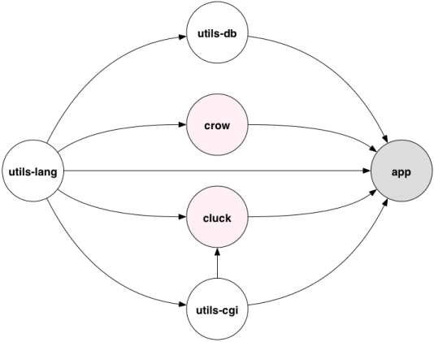

# Disclaimer 

This is an old project which I previously released as a Mercurial repository on Bitbucket back in 2014. That repository is no longer accessible so I am placing it here on GitHub in the hope that others may find some value in it. However, please note that I have not maintained or used the code in several years and do not know if it works with the latest versions of the other software upon which it depends.

# Cluck and Crow

## Synopsis

_Cluck_ implements a generalised web gateway interface that enables a Common Lisp [CGI](http://www.ietf.org/rfc/rfc3875) script to run as a persistent process whilst communicating transparently with a web server using the [SCGI](http://python.ca/scgi/protocol.txt) protocol, in a similar way to [Perl's SCGI module](http://search.cpan.org/~vipercode/SCGI-0.6/lib/SCGI.pm). It does this by redirecting standard input and output through a socket stream. It also provides an interface in the style of [WSGI](http://wsgi.readthedocs.org/en/latest/), [Rack](http://rack.github.io/), [PSGI/Plack](http://plackperl.org/) and [Clack](http://clacklisp.org/) but without sacrificing the underlying compatibility with CGI. 

_Crow_  is a micro web-framework which, together with supporting packages, provides a suite of macros which generate HTML 5 elements, access form parameters and implement some Common Lisp language and database utilities.

The project consists of four package files:  

- cluck.lisp
- crow.lisp
- utils-cgi.lisp
- utils-db.lisp
- utils-lang.lisp

Here is a simple example which gives a flavour of how it can be used:

    (let ((n 0))
        (with-gi "scgi" 8080
            (setf n (+ n 1))
            (with-env-params 
                (format t 
                    (strcat
                        ;; Print HTTP headers...
                        "Status: 200 OK~%"
                        "Content-Type: text/html; charset=ISO-8859-1~%~%"

                        ;; Print number of times called...
                        (
 () (mkstr "Called: " n " times"))
                        (
)

                        ;; Print env vars...
                        (
 () "Env: " (princ-to-string env ))
                        (
)

                        ;; Print parameters...
                        (
 () "Params: " (princ-to-string params ))
                        (
))))))

## Introduction

This project had several objectives, the main ones being:

1. A Common Lisp implementation of the [SCGI](http://python.ca/scgi/protocol.txt) protocol which enables a [CGI](http://www.ietf.org/rfc/rfc3875) script to run as a persistent process  in a similar way to [Perl's SCGI module](http://search.cpan.org/~vipercode/SCGI-0.6/lib/SCGI.pm).
2. A Common Lisp interface-agnostic middleware component serving both CGI and SCGI requests. This is influenced by, but does not mimic, [WSGI](http://wsgi.readthedocs.org/en/latest/), [Rack](http://rack.github.io/), [PSGI/Plack](http://plackperl.org/) and [Clack](http://clacklisp.org/).
3. A Common Lisp micro web-framework.
4. Compatible with a standard [Apache](http://httpd.apache.org/) HTTP  web server. 

I have been guided by the following ideals, although do not claim to have fulfilled them:

- Minimalism - include only essential functionality;
- Simplicity - only as complex as required by the minimalist requirements;
- Elegance - code should be well structured, e.g. loosely coupled and well factored.

On a personal note, this project has been a journey into Common Lisp as well as an opportunity to give something back to the open source community.

An important consideration, which has determined a number of technical decisions, has been my desire to maintain compatibility with the original [CGI specification](http://www.ietf.org/rfc/rfc3875) and it's implementation in commonly used web servers and operating systems. Unlike the requirements in the _WSGI_ and _PSGI_ specifications, a _Cluck_ application, like a CGI script, can communicate with the web server through meta variables implemented by operating system environment variables and,if present, a request message-body   accessible through the standard input file handle. I say _can_ because it is equally possible to build a _Plack/Clack_-like layer that allows the web application to interface with the web server through the parameter list of an application function as demonstrated below.

A note on the names _Cluck_ and _Crow_: I have always found naming things one of the more challenging aspects of programming and this project has been no exception. The name _Cluck_ is onomatopoeicly  derived from the word _Clack_, the quieter noise reflecting its more lowly ambitions. _Crow_ builds on _Cluck_, the louder noise reflecting its higher position up the application stack.

## Getting Started

### Apache Configuration

The following lines should be uncommented in your Apache httpd.conf file:

	# Uncomment these lines...
    LoadModule proxy_module modules/mod_proxy.so
    LoadModule proxy_scgi_module modules/mod_proxy_scgi.so

In addition, add the following lines, or similar depending on your requirements:

	ProxyPass /scgi/demo scgi://localhost:8080/

	<Proxy *>
	Require ip 127.0.0.1
	</Proxy>

### Running Cluck

The simplest way of running the examples below is to place the module package and example code into the same folder or directory. For the _CGI_ examples, the files must be placed in the _cgi-bin_ folder. For the _SCGI_ examples, the files can be placed in any folder. Note that _mod\_proxy\_scgi_ does not start the SCGI application automatically - it must be started independently before any requests are sent to the web server. The easiest way to do this is to load the file containing the application or example into the Lisp REPL which will cause it to connect to a port and start waiting on requests.

## Packages, Modules and Forms

Each file implements a single package (name space) as well as a single module. The following diagram shows the dependencies between the packages:

### cluck.lisp

Implements the SCGI protocol as well as the generalised gateway interface.

The principal forms are:

    with-scgi - SCGI handler
    with-gi - generalised gateway interface
	cluck - inspired by WSGI, Rack, PSGI/Plack and Clack.

### crow.lisp

A micro web-framework which provides a set of macro forms for generating HTML 5 elements, as well as higher level utility forms. The elements are generated  in a generic manner using macros which define macros.

### utils-cgi.lisp 

Implements low-level CGI functionality, including the retrieval of GET and POST parameters via _application/x-www-form-urlencoded_  and _multipart/form-data_ content types. The principal form exported by _utiles-cgi.lisp_ is:

    with-env-params

### utils-lang.lisp
Basic language-level utility forms for handling strings, lists, arrays, io, regular expressions etc.

### utils-db.lisp 

Forms for handling database connectivity based on [plain-odbc](http://common-lisp.net/project/plain-odbc/). This is a very simple interface, the sole purpose of which is to execute stored procedures in a database-agnostic fashion. The motivation for focusing on stored procedures is a) a desire to avoid the direct use of SQL in applications and b) a desire to avoid the added complexity of database middleware.

Currently, only Postgres _plpgsql_  and SQL Server _T-SQL_ are supported. These forms are still very much experimental, 

## Principal Forms

### with-env-params

_with-env-params_ is an anaphoric macro which introduces the following variables:

- ___env___: contains an association list of the CGI meta variables;
- ___params___: contains an association list of the parameters and values from the query string or the message request body. 

Note that each value in _params_ is itself a list of one or two values:

- one value for a normal parameter
- two values for a file parameter: 
    - the first value is the name of the file;
    - the second is the file contents.

An example of such a parameter list might be:

    (("page" "select_file") ("file_1" "file_name_" "file content...")) 

Note that files can contain binary or character data.

The following example demonstrates the use of _with-env-params_ with with plain CGI:

	#! C:\Program Files\clisp-2.49\clisp.exe -K full --quiet

	;; CGI script demonstrating use of utils-cgi:with-env-param

    (require :utils-cgi)
    (import '(
        utils-cgi:with-env-params
        utils-cgi:env
        utils-cgi:params))

    (with-env-params 
        ;; Print HTTP headers...
        (format t "Status: 200 OK~%")
        (format t "Content-Type: text/html~%~%")

        ;; Print env vars...
        (format t "
 Env: ~A 
~%" (princ-to-string env))

        ;; Print parameters...
        (format t "
 Params: ~A 
~%" (princ-to-string params)))

### HTML Element Generation

The full list of [HTML 5](http://www.w3.org/TR/html-markup/elements.html) elements is supported. This is achieved through two types of macro, both of which generate HTML  elements as strings. _Void_ elements are generated by a macro form the name of which is the element tag name enclosed in angle brackets with no spaces, followed by pairs of attribute names and values as follows:

    ( <tag> "attribute 1" "value 1" "attribute 2" "value 2" ...)

For example: 

    ( <input> "type" "submit" "name" "submit_button" "value" "submit file" ) 

_Non-void_ elements are generated by a macro form, the naming of which folows that for void elements, followed by a list of attribute/value pairs, followed by the element contents, as follows:

    ( <tag> ("attribute 1" "value 1" "attribute 2" "value 2") 
		"some content" 
		"more content" ... )

For example:

    ( 
 ("class" "some_class") "This is" " a paragraph" )

The html macros are named with angle brackets surrounding the tag name, and not with the bare tag name, because of the conflict between a small number of tag names and reserved words in Common Lisp , specifically _map_ and _time_.

The previous example of _with-env-params_ can be rewritten as follows:

    #! C:\Program Files\clisp-2.49\clisp.exe -K full --quiet

    ;; CGI script demonstrating;
    ;; - use of with-env-params 
    ;; - HTML-generating macros 
, 

    ;; - CGI utility macros: send-params, http-status and http-conent-type

    (require :utils-lang)
    (require :utils-cgi)
    (require :crow)

    (import '(
        utils-lang:nl
        utils-cgi:with-env-params
        utils-cgi:env
        utils-cgi:params
        utils-cgi:http-status
        utils-cgi:http-content-type
        utils-cgi:send-response
        crow:

        crow:

    ))

    (with-env-params 
        (send-response

            ;; Print HTTP headers...
            (http-status 200) (nl)
            (http-content-type 'html) (nl) (nl)

            ;; Print env vars...
            (
 () "Env: " (princ-to-string env ))
            (
)

            ;; Print parameters...
            (
 () "Params: " (princ-to-string params ))
            (
)))
            

Note some additional macro forms have been introduced above:

- `send-response`  concatenates its arguments and writes them to standard output;
- `http-status` tales a integer denoting an [HTTP response status](http://www.iana.org/assignments/http-status-codes/http-status-codes.xhtml) and returns an HTTP status header string;
- `http-content-type` takes a symbol, either 'text or 'html, and generates the appropriate HTTP header.

### with-scgi

A fundamental feature of _Cluck_ is that the SCGI layer, implemented by the form _with-scgi_, can be used as a wrapper around existing CGI code without need for modification in any way. Assuming the web server has been correctly configured for SCGI, it is used as follows:

    ;; SCGI script demonstrating use of with-scgi

    (require :utils-lang)
    (require :utils-cgi)
    (require :crow)
    (require :cluck)

    (import '(
        utils-lang:nl
        utils-lang:mkstr
        utils-cgi:with-env-params
        utils-cgi:env
        utils-cgi:params
        utils-cgi:http-status
        utils-cgi:http-content-type
        utils-cgi:send-response
        crow:

        crow:

        cluck:with-scgi
    ))

    (let ((n 0))
        (with-scgi 8080
            (setf n (+ n 1))
            (with-env-params 
                (send-response

                    ;; Print HTTP headers...
                    (http-status 200) (nl)
                    (http-content-type 'html) (nl) (nl)

                    ;; Print number of times called...
                    ( 
 () (mkstr "Called: " n " times"))
                    (
)

                    ;; Print env vars...
                    (
 () "Env: " (princ-to-string env ))
                    (
)

                    ;; Print parameters...
                    (
 () "Params: " (princ-to-string params ))
                    (
)))))

Note that, in the above example, the macro form _with-scgi_ binds the special variables _\*standard-input\*_ and _\*standard-output\*_ to port 8080. Therefore, within  the form's scope, these file handles can be used to receive data from, and send data to, the web server in the manner of a traditional CGI script.

### with-gi

The form _with-gi_ abstracts away from the specific interface and allows for handlers to be implemented by defining a form prefixed with the name _with-_. The form _with-scgi_ is such a handler which is invoked from the form _with-gi_ as follows:

    ;; SCGI script demonstrating use of with-gi

    (require :utils-lang)
    (require :utils-cgi)
    (require :crow)
    (require :cluck)

    (import '(
        utils-lang:nl
        utils-lang:mkstr
        utils-cgi:with-env-params
        utils-cgi:http-status
        utils-cgi:http-content-type
        utils-cgi:send-response
        crow:

        cluck:with-gi
        cluck:with-scgi
    ))

    (let ((n 0))
        (with-gi "scgi" 8080
            (setf n (+ n 1))
            (with-env-params 
                (send-response

                    ;; Print HTTP headers...
                    (http-status 200) (nl)
                    (http-content-type 'html) (nl) (nl)

                    ;; Print number of times called...
                    ( 
 () (mkstr "Called: " n " times"))))))

Note the following:

- The symbol _cluck:with-scgi_ has to be imported into the package where _with-gi_ is used;
- A _CGI_ handler form, _with-cgi_, is also provided. It effectively does nothing more than allow the same programme structure to be used for both CGI and SCGI applications, meaning that the programme is _interface-agnostic_;
-  Additional handlers could be written, e.g. for [FastCGI](http://www.fastcgi.com/drupal/).

### cluck

The form _cluck_ implements a layer on top of the forms _with-gi_ and _with-env-params_ and permits a web application to be structured in a similar way to  a [_Clack_](http://clacklisp.org/) application. Here is a simple example:

    ;; CGI script demonstrating use of cluck

    (require :utils-lang)
    (require :utils-cgi)
    (require :crow)
    (require :cluck)

    (import '(
        utils-lang:mkstr
        utils-cgi:http-status
        utils-cgi:http-content-type
        crow:

        crow:

        cluck:with-scgi
        cluck:cluck
    ))

    (defun demo-app ( state env params )

        ;; Increment the global counter...
        (if (null (gethash 'count state))
            (setf (gethash 'count state) 0)
            (setf (gethash 'count state) (+ 1 (gethash'count state))))

        ;; Return a list whose first two members are http status and content type. 
        ;; The remaining members comprise the response body.
        (list 
            (http-status 200) 
            (http-content-type 'html)

            ;; Print number of times called...
            ( 
 () (mkstr "Called: " (gethash 'count state) " times"))
            (
)

            ;; Print env vars...
            (
 () "Env: " (princ-to-string env ))
            (
)

            ;; Print parameters...
            (
 () "Params: " (princ-to-string params ))
            (
)))

    (cluck #'demo-app "scgi" 8080)

Note the following:

- The call to _cluck_ results in the function _demo-app_ being called with the arguments:
	-  _state_: a hash that can be used to maintain state between requests - in the above example it is used to hold a counter of the number of times the application has been called;
	-  _env_: an association list of  CGI meta-variables;
	-  _params_: an association list of parameters parsed from the query string and/or the request message-body;
-  The contents of the hash variable _state_ are changed in the calling environment as a consequence of Common Lisp's mutable data types and the fact that, although Common Lisp function arguments are passed by value, for compound data types such as lists and hashes the _places_ that they contain are effectively passed by reference;
- It is necessary for _with-scgi_ to be imported as the call to _cluck_ gets replaced with this.

### Databse Access

The principal forms are:

`(db-connect "dsn" "server" "port" "database" "username" "password")`

_db-connect_ connects to a database using an ODBC dsn. The username and password parameters are optional for SQL Server drivers. If not supplied then a trusted connection is made. 

`(db-proc-to-list dbcon "stored_proc_name")`

_dbcon_ is the connection object returned by _db-connect_. It assumes the stored procedure _does not_ write to the database and therefore no commit is done. It returns a list of rows each of which is a list of column values. 

`(db-proc dbcon "stored_proc_name")`

Assumes that the the stored procedure _does_ write to the database and therefore does a commit after executing the procedure. It returns the first value returned by the procedure. This could be a rowcount for example, or -1 in case of an exception, error, rollback etc.

## Implementation Notes

### Systems Used
The project has been implemented using the following systems:

- [CLISP](http://www.clisp.org/) version 2.49
- Windows 7
- Appache 2.4.4 from [Apache Lounge](http://www.apachelounge.com/)
- [mod\\_proxy\\_scgi](http://httpd.apache.org/docs/current/mod/mod_proxy_scgi.html)
- [PostgreSQL](http://www.postgresql.org/) 9.1.11

### Portability Issues

There are several areas in the code that are likely to give rise to portability issues.

- Use of CLISP's ext packge:
    - getenv
- The _setf-able_ property of function _stream-element-type_ is exploited to convert standard input to _UNSIGNED-BYTE 8_:

        (setf (stream-element-type *standard-input*) '(UNSIGNED-BYTE 8) )

    This is a useful feature of _CLISP_ (see Implementation Notes for GNU CLISP on [stream-element-type](http://www.clisp.org/impnotes/stream-eltype.html) and [socket streams](http://www.clisp.org/impnotes.html#socket)) which has been used to enable the reading of binary files in the message request body.

- HTML documents are currently encoded with charset _iso-8859-1_. I need to find a portable way of converting a binary array into a string using the charset specified in Content-Type http header. The code currently uses code-char which uses the 'default' charset but can't it's not clear to me how CLISP chooses a default charset. I suspect  [babel](http://quickdocs.org/babel/) might be a portable way to do this.

## Future Developments

The following are some of the areas I would like to develop or add support for in future:

- Support for utf-8
- Additional error handling and increased robustness;
- Increased portability across other Common Lisp platforms;
- Additional higher level HTML utilities, including CSS and JavaScript; 
- Better support for database access, including support for other databases such as MySQL and Oracle;
- Support for [FastCGI](http://www.fastcgi.com/drupal/);
- Port to [Arc](http://www.paulgraham.com/arc.html) and/or [Clojure](http://clojure.org/);
- Addition of asynchronous handling of requests, e.g. using [cl-async](https://github.com/orthecreedence/cl-async);
- Session handling
- LDAP Authentication 

## Acknowledgements

I would like to thank all those who took the time and effort to respond to my questions on the [CLISP mailing list](https://lists.sourceforge.net/lists/listinfo/clisp-list), including Sam Steingold and Michael Kappert who provided invaluable [help and advice](http://sourceforge.net/p/clisp/mailman/message/30124412/) with REGEXP and PCRE issues (in early versions - I now use CL-PPCRE), as well as  Raymond Toy and Pascal J. Bourguignon for their  [suggestions](http://sourceforge.net/p/clisp/mailman/message/31188168/) regarding reading of character and binary data from socket streams. Thanks to Stephen Shorrock for trying out the examples above and for his comments and feedback.

I have endeavoured to reference sources of information, ideas and code within the code itself. However, I would like to mention Paul Graham's [_On Lisp_](http://www.paulgraham.com/onlisptext.html) which helped me figure out how to use nested backquotes (amongst other things).
